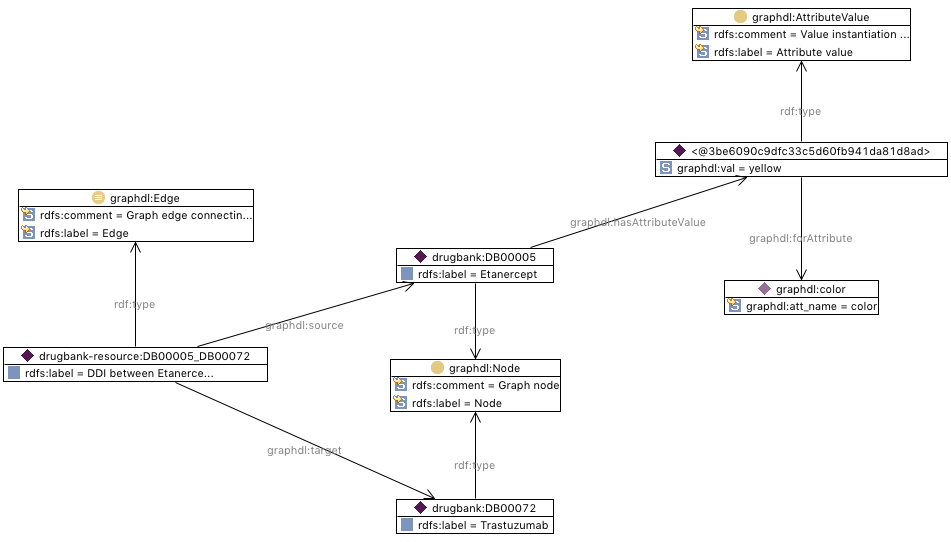

# GraphDL ontology

## Constructors
The main elements of the GraphDL ontology are the following:

1. _Graph_ class: Graphs encompassing nodes, edges, and nested graphs. They can be defined as directed or undirected.

2. _Node_ class: Graph nodes.

3. _Edge_ class: Graph edges, connecting  a _source_ node and a _target_ node.

4. _Attribute_ class: Graph element attribute, associated to nodes or edges. Attribute instances are: _id_, _label_, _color_, node _size_, edge _weight_, node _x_ and _y_ position,  etc. More attributes can be added at convenience.

5. _AttributeValue_ class: Instantiation of an attribute value. The instances of this class act as the reification of the relationships between graph elements and attribute values. _AttributeValue_ instances are associated to _Node_ and _Edge_ instances by means of the property _hasAttributeValue_.

6. _forAttribute_ property: Associates an _AttributeValue_ with the _Attribute_ for which it takes value.

7. _val_ property: Associates an _AttributeValue_ with a literal value. The type of this literal should be consistent with the type defined for the corresponding attribute (in principle, this is not forced by the ontology).

## Example
The next figure shows the representation of a drug-to-drug interaction built from the information of DrugBank.

For the first node _drugbank:DB00005_, the value _yellow_ is assigned to the attribute _color_. We can see that the (reified) attribute value is represented by means of a blank node of type _graphdl:AttributeValue_. This blank node has associated a datatype property _graphdl:val_, with value _yellow_), and an object property (_graphdl:forAttribute_, with value _graphdl:color_). 

A more detailed example including RDF encoding can be found in [this folder](graph-sample.ttl).

